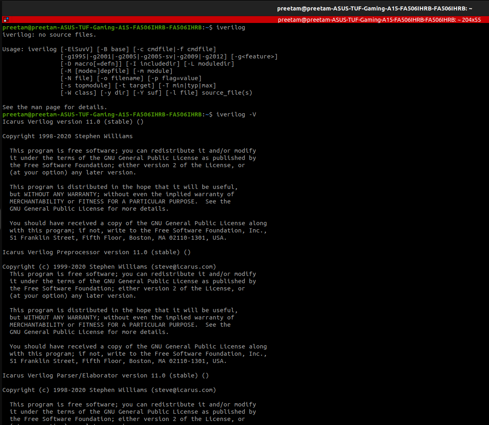
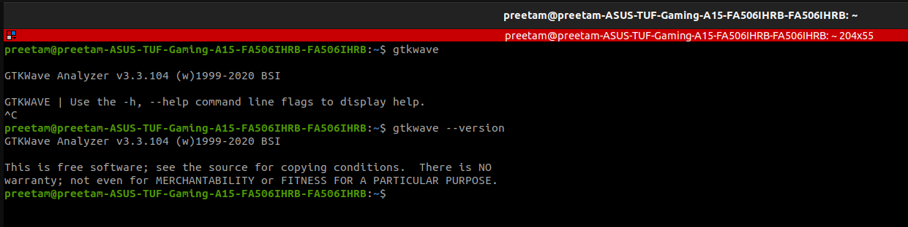
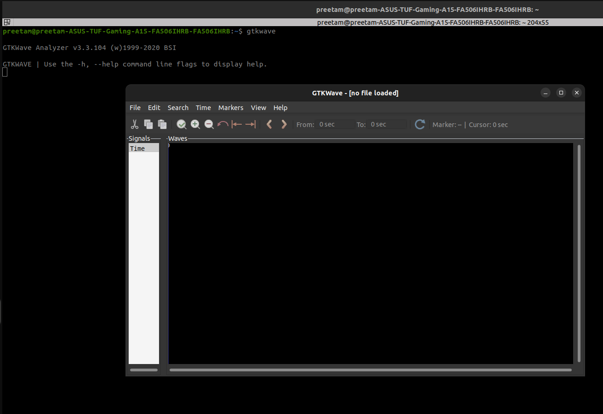
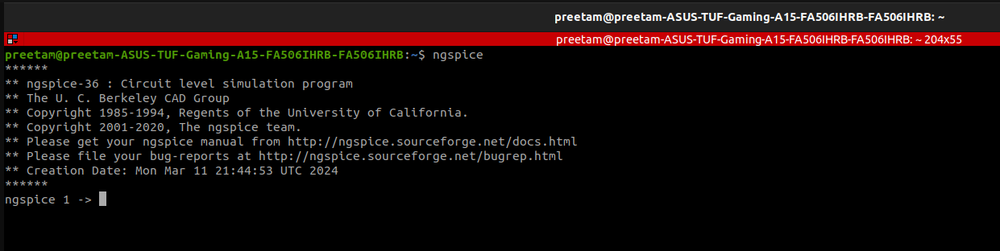
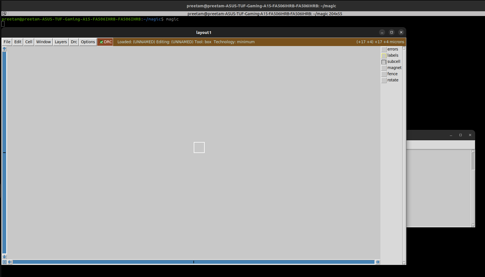
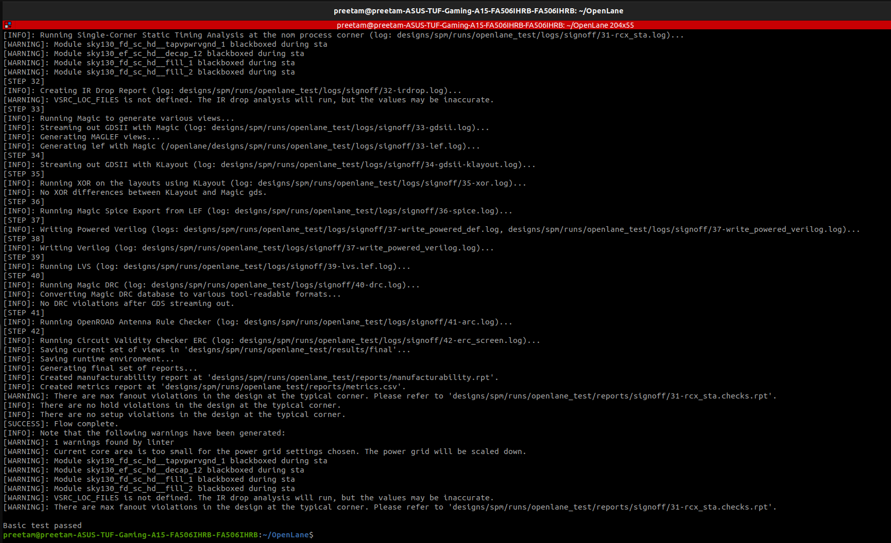

## Yosys

### 1. Commands Run
```bash
sudo apt-get update
git clone https://github.com/YosysHQ/yosys.git
cd yosys
sudo apt-get install build-essential clang bison flex \
  libreadline-dev gawk tcl-dev libffi-dev git \
  graphviz xdot pkg-config python3 libboost-system-dev \
  libboost-python-dev libboost-filesystem-dev zlib1g-dev
git submodule update --init --recursive
make -j"$(nproc)"
sudo make install
yosys -V
````

### 2. Verification Screenshot


### 3. Problems Faced

* **Error:** `E: Unable to locate package zlib1g-d`
  **Fix:** Corrected to `zlib1g-dev`
* **Error:** `make: *** No rule to make target 'config-gcc'`
  **Fix:** Skipped `make config-gcc`; used `make && sudo make install`
* **Error:** `Initialize the submodule: Run 'git submodule update --init'`
  **Fix:** Ran `git submodule update --init --recursive`

---

## Icarus Verilog

### 1. Commands Run

```bash
sudo apt-get update
sudo apt-get install iverilog
iverilog -V
```

### 2. Verification Screenshot




## GTKWave

### 1. Commands Run

```bash
sudo apt-get update
sudo apt-get install gtkwave
gtkwave --version
```

### 2. Verification Screenshot




### 3. Problems Faced

* **Warning:** `Gtk-Message: Failed to load module "canberra-gtk-module"`
  **Fix:** Installed missing module:

  ```bash
  sudo apt-get install libcanberra-gtk-module libcanberra-gtk3-module
  ```

---

## ngspice

### 1. Commands Run

```bash
# download ngspice-37.tar.gz from SourceForge
tar -zxvf ngspice-37.tar.gz
cd ngspice-37
mkdir release && cd release
../configure --with-x --with-readline=yes --disable-debug
make
sudo make install
ngspice -v
```

### 2. Verification Screenshot



### 3. Problems Faced

*(fill if any)*

---

## Magic

### 1. Commands Run

```bash
sudo apt-get install m4 tcsh csh libx11-dev tcl-dev tk-dev \
  libcairo2-dev mesa-common-dev libglu1-mesa-dev libncurses-dev
git clone https://github.com/RTimothyEdwards/magic
cd magic
./configure
make
sudo make install
magic -v
```

### 2. Verification Screenshot




## OpenLANE

### 1. Commands Run

```bash
sudo apt-get update && sudo apt-get upgrade
sudo apt install -y build-essential python3 python3-venv python3-pip make git \
  apt-transport-https ca-certificates curl software-properties-common

# Docker setup
curl -fsSL https://download.docker.com/linux/ubuntu/gpg | sudo gpg --dearmor -o \
  /usr/share/keyrings/docker-archive-keyring.gpg

echo "deb [arch=amd64 signed-by=/usr/share/keyrings/docker-archive-keyring.gpg] \
https://download.docker.com/linux/ubuntu $(lsb_release -cs) stable" | \
sudo tee /etc/apt/sources.list.d/docker.list > /dev/null

sudo apt update
sudo apt install docker-ce docker-ce-cli containerd.io

# Verify docker works
docker run hello-world

# Clone and test OpenLANE
cd $HOME
git clone https://github.com/The-OpenROAD-Project/OpenLane
cd OpenLane
make
make test
```

### 2. Verification Screenshot




# ✅ Summary

* Installed all required tools: **Yosys**, **Icarus Verilog**, **GTKWave**, **ngspice**, **Magic**, and **OpenLANE**
* Verified installation with version outputs and test runs
* Documented errors and fixes for future reference
* All verification screenshots stored in `WEEK-00/assets/`

```

